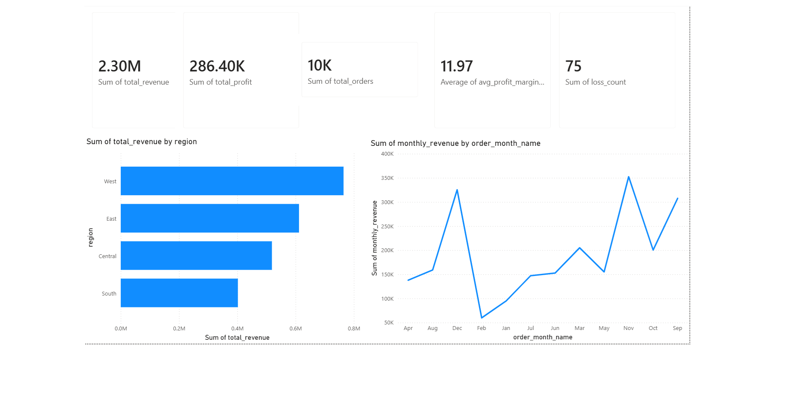
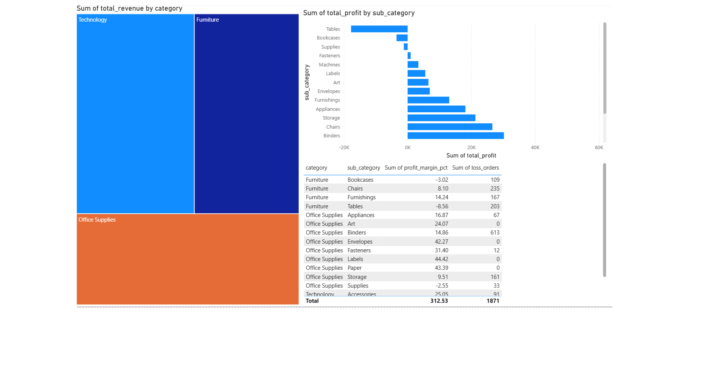
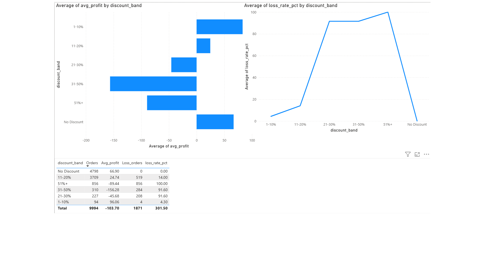
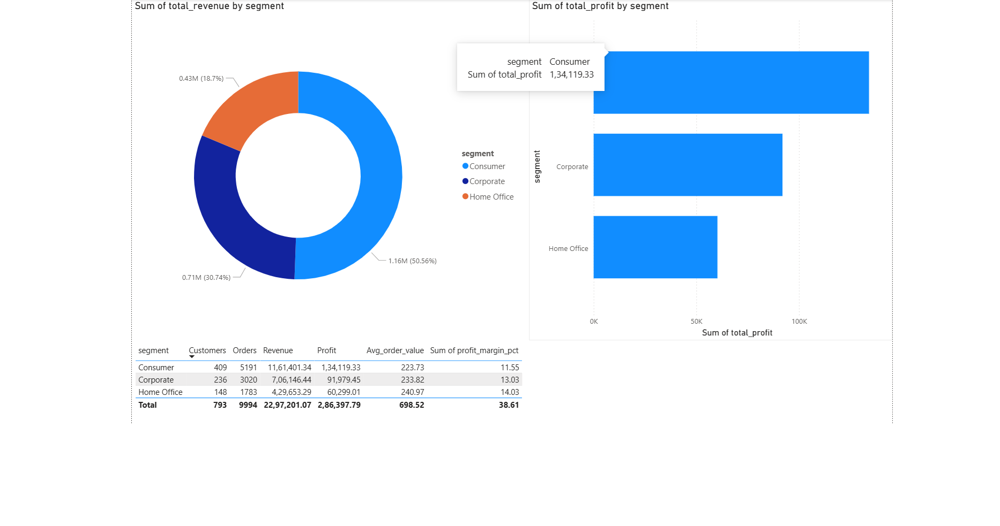
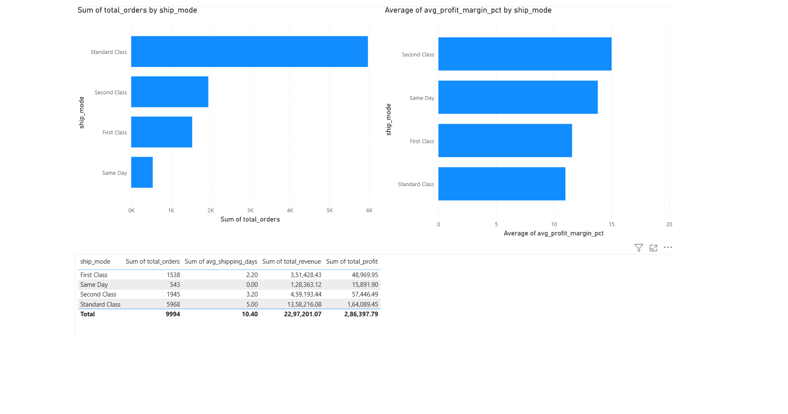

🛒 E-Commerce Sales Analytics Dashboard
Tools: Python · MySQL · SQL · Power BI · Excel  
Dataset: 9,994 orders · 4 years · US Superstore Sales Data  
Author: Abhishek Jha · LinkedIn · GitHub
---
📌 Project Overview
This project analyses 4 years of US e-commerce sales data to uncover profit trends, discount impact, regional performance, and customer segment behaviour. The goal was to answer real business questions a sales or operations team would ask — not just visualise numbers, but find actionable insights.
The full pipeline covers data cleaning, feature engineering, MySQL database loading via a star schema, 8 SQL business queries, and a 5-page interactive Power BI dashboard.
---
🗂️ Project Structure
```
ecommerce-sales-analytics/
│
├── 01_clean_data.py          # Data cleaning + EDA + feature engineering
├── 02_load_mysql.py          # Star schema creation + MySQL data load
├── 03_analysis.py            # 8 SQL business queries + Excel export
├── sql_queries.sql           # All 8 queries standalone
├── requirements.txt          # Python dependencies
│
├── data/
│   └── superstore_clean.csv  # Cleaned dataset (9,994 rows)
│
└── outputs/
    └── business_insights.xlsx # 8-sheet Excel report
```
---
🗄️ Database Design — Star Schema (MySQL)
Table	Type	Rows	Description
`fact_orders`	Fact	9,994	One row per order line
`dim_customer`	Dimension	793	Unique customers
`dim_product`	Dimension	1,850	Unique products
`dim_region`	Dimension	4	West, East, Central, South
`dim_segment`	Dimension	3	Consumer, Corporate, Home Office
`dim_ship_mode`	Dimension	4	Shipping modes
---
🔍 8 Business SQL Queries
#	Business Question
Q1	Which region generates the highest profit?
Q2	What are the top 10 most profitable products?
Q3	Which categories and sub-categories lose money?
Q4	At what discount % does profit turn negative?
Q5	What is the monthly revenue trend across 4 years?
Q6	How do customer segments compare in revenue and profit?
Q7	Does faster shipping correlate with higher profit?
Q8	Which products consistently generate losses?
---
📊 Key Business Findings
Metric	Value
Total Revenue	$2,297,201
Total Profit	$286,397
Overall Profit Margin	12.5%
Total Orders	9,994
Unique Customers	793
Loss-Making Orders	1,871 (18.7%)
🔴 Critical Findings
Furniture Tables operate at -8.56% profit margin — high sales volume masking consistent losses
Discounts above 20% destroy profit — 91.6% of orders with 31-50% discount are loss-making
856 orders with 51%+ discount = 100% loss rate — zero profitable orders in this band
🟢 Positive Findings
Technology category leads at 17% profit margin — Copiers alone drive significant profit
West region is most profitable — highest margin across all 4 regions
Consumer segment generates 50.56% of total revenue — largest and most valuable segment
Q4 is peak revenue quarter — consistent across all 4 years of data
💡 Business Recommendations
Eliminate or cap discounts above 20% — current discount policy is destroying $103 average profit per order in the 31-50% band
Review Furniture Tables pricing strategy — product generates revenue but loses money on every sale
Invest in Technology category expansion — highest margin, strong demand
Focus retention efforts on Consumer segment — largest revenue contributor
---
📈 Power BI Dashboard — 5 Pages
Page 1 — Executive Overview

Page 2 — Category Performance

Page 3 — Discount Analysis

Page 4 — Customer Segments

Page 5 — Shipping Analysis

---
⚙️ How to Run
1. Install dependencies
```bash
pip install -r requirements.txt
```
2. Set up MySQL
```sql
CREATE DATABASE ecommerce_db;
```
3. Run scripts in order
```bash
python 01_clean_data.py    # Clean and explore data
python 02_load_mysql.py    # Load into MySQL star schema
python 03_analysis.py      # Run SQL queries + export to Excel
```
4. Update MySQL password
In `02_load_mysql.py` and `03_analysis.py`, update:
```python
'password': 'your_mysql_password'
```
---
🛠️ Tools & Technologies
Tool	Purpose
Python (pandas, numpy)	Data cleaning, feature engineering
MySQL 8.0	Star schema database, SQL queries
Power BI	5-page interactive dashboard
Excel (openpyxl)	Business insights export
Git / GitHub	Version control
---
Part of a data analytics portfolio — building toward Data Analyst and Business Analyst roles.
